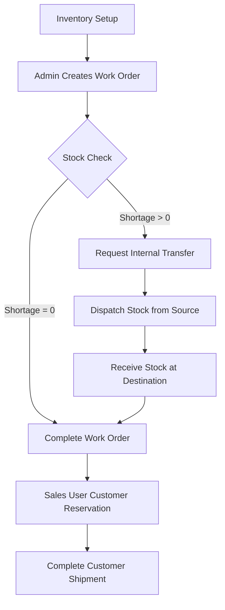

# Mini Operations ERP

A production-oriented full-stack operations ERP covering the inventory, work order, stock transfer, and customer order reservation lifecycle.

This project was built for the **Full-Stack Developer Technical Case Study**.

## Tech Stack

- **Frontend**: React + TypeScript + Vite + Vanilla CSS
- **Backend**: Node.js + Express + TypeScript
- **Database**: PostgreSQL (v17)
- **ORM**: Prisma (v6)
- **Authentication**: JWT (JSON Web Tokens)
- **API Documentation**: Postman Collection (v2.1)
- **Testing**: Node E2E Integration Suite

---

## Core Operations Workflow



1. **Inventory**: Stock is tracked by `Item`, `Category`, `Location`, and `Batch`. Quantities are tracked dynamically:
   - $Available = Physical - Reserved$
   - Real-time stock movement ledger captures every physical/reserved change.
2. **Work Orders**: Admin creates work orders at specific locations. The system automatically calculates shortages:
   - $Shortage = \max(0, Required - Available)$
   - Work order completion automatically consumes (deducts) physical stock from available batches at the location.
3. **Internal Stock Transfers**: Operations user requests, dispatches, and receives transfers:
   - **Dispatch**: Decreases source physical stock.
   - **Receipt**: Increases destination physical stock.
   - **Verification**: Destination inventory does not increase until receipt. The same transfer cannot be received twice.
4. **Customer Orders**: Sales user reserves stock:
   - System enforces serializable transactions/row-level locks (`SELECT ... FOR UPDATE`) to guarantee transaction safety, preventing over-reservation.

---

## Database Schema & ER Diagram

The PostgreSQL database structure consists of the following primary tables:

### 1. `User`
Stores system accounts with credentials and roles.
- `id` (PK, Int): Unique ID
- `name` (String): Full name
- `email` (String, Unique): Username
- `passwordHash` (String): Bcrypt hash
- `role` (Role Enum): `ADMIN`, `OPERATIONS_USER`, `SALES_USER`

### 2. `InventoryItem`
Real-time batch-level inventory.
- `id` (PK, Int): Unique ID
- `item` (String): Item name/code
- `category` (String): Item category
- `location` (String): Warehouse/Storage location
- `batch` (String): Batch code
- `physicalQty` (Int, Default: 0): Physical units in stock (must be $\ge 0$)
- `reservedQty` (Int, Default: 0): Reserved units in stock ($0 \le reservedQty \le physicalQty$)
- *Note*: Available Qty is dynamically computed as `physicalQty - reservedQty`

### 3. `WorkOrder`
Tracks manufacturing and raw material requirements.
- `id` (PK, Int): Unique ID
- `location` (String): Target location
- `item` (String): Required item
- `requiredQty` (Int): Total required units
- `assignedUserId` (FK): Assigned operations user/admin
- `status` (Enum): `ASSIGNED`, `IN_PROGRESS`, `COMPLETED`
- `shortageQty` (Int): Recalculated shortage quantity

### 4. `InternalTransfer`
Controls stock movements between warehouses.
- `id` (PK, Int): Unique ID
- `sourceLocation` (String): Dispatch warehouse
- `destinationLocation` (String): Target warehouse
- `item` (String): Item code
- `batch` (String): Batch being moved
- `quantity` (Int): Units to move
- `status` (Enum): `REQUESTED`, `DISPATCHED`, `RECEIVED`
- `createdById` (FK): Operations user requesting the transfer

### 5. `CustomerOrder`
Locks inventory for sales orders.
- `id` (PK, Int): Unique ID
- `customerName` (String): Buyer name
- `item` (String): Reserved item
- `location` (String): Source location
- `batch` (String): Batch reserved
- `quantity` (Int): Reserved units
- `status` (Enum): `RESERVED`, `COMPLETED`, `CANCELLED`
- `createdById` (FK): Sales user who created the order

### 6. `StockLog`
Auditable ledger of stock transactions.
- `id` (PK, Int): Unique ID
- `item` (String), `location` (String), `batch` (String): Identifiers
- `quantity` (Int): Change in physical quantity
- `reservedChange` (Int): Change in reserved quantity
- `type` (String): Log event type (e.g. `TRANSFER_DISPATCH`, `CUSTOMER_RESERVE`)
- `referenceId` (String): Associated ID (e.g. `WO-1`, `TR-2`, `CO-3`)

---

## Local Setup

### 1. Database Setup
Start your local PostgreSQL instance and create a database named `fundsroom_erp`. 
If you are running the project root script, it defaults to port **5433**:
```env
DATABASE_URL="postgresql://postgres@127.0.0.1:5433/fundsroom_erp"
```

### 2. Installation
From the root directory:
```bash
# Install root, backend, and frontend dependencies
npm install
cd backend && npm install
cd ../frontend && npm install
```

### 3. Initialize & Seed Database
Configure environment variables in `backend/.env` (copy `backend/.env.example`), then run:
```bash
cd backend
# Sync PostgreSQL schema with Prisma
npx prisma db push --force-reset
# Populate users and initial stock
npm run seed
```

### 4. Run Locally
Start the development servers for both backend and frontend:
```bash
# In the root folder, run:
# Terminal 1: Starts PostgreSQL (if configuring local PG bin path)
npm run 1.start-database
# Terminal 2: Starts the Express API server (port 5000)
npm run 2.start-backend
# Terminal 3: Starts the Vite Dev Server (port 5173)
npm run 3.start-frontend
```

---

## Demo Credentials

The database seed script sets up three demo users representing the required case study roles:

| Role | Email | Password | Privileges |
|---|---|---|---|
| **Admin** | `admin@fundsroom.local` | `Admin@123` | Create Work Orders, Full Access |
| **Operations User** | `ops@fundsroom.local` | `Ops@123` | Manage Inventory, Process Transfers & Work Orders |
| **Sales User** | `sales@fundsroom.local` | `Sales@123` | Create Customer Orders & Reserve Stock |

---

## Running Integration Tests

A comprehensive integration test suite verifies the mandatory business rules. To execute it:
```bash
cd backend
npm run test
```

This runner programmatically spins up a mock instance of the server and tests:
1. **Cannot reserve more than available inventory**: Blocks sales orders exceeding available stock.
2. **Cannot transfer more than available inventory**: Rejects stock transfers exceeding source available levels.
3. **Destination stock increases only after receipt**: Asserts that source stock decreases on dispatch, but destination stock does not change until receipt.
4. **Same transfer cannot be received twice**: Enforces single receipt execution.
5. **Unauthorized users cannot perform restricted operations**: Blocks Sales from creating work orders and Operations from creating customer reservations.
6. **Concurrency Safety**: Launches concurrent requests to assert that database transactions with row locks prevent race condition over-reservations.
